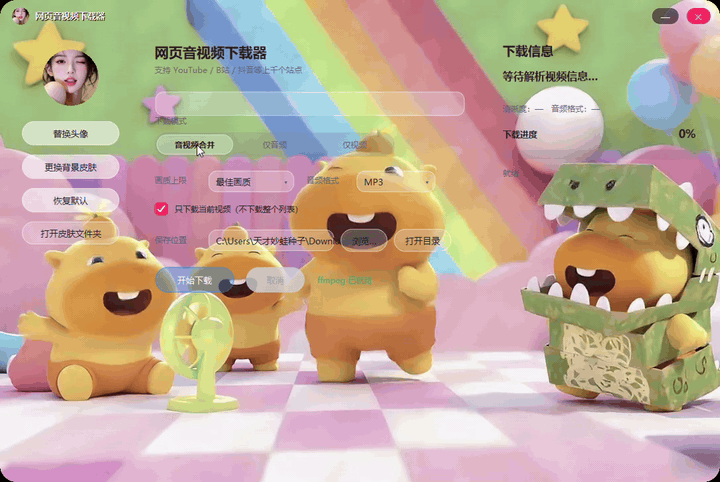
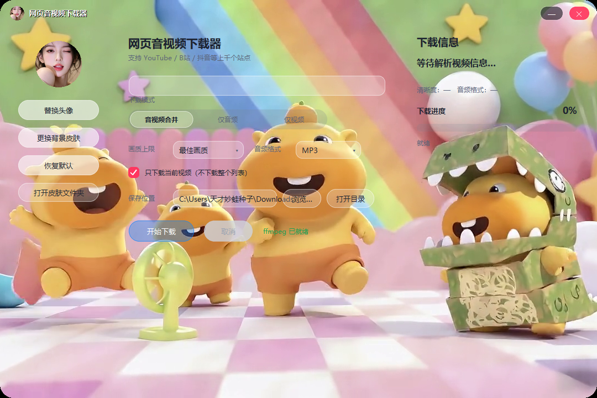

# MediaDownloader 网页音视频下载器

基于 [yt-dlp](https://github.com/yt-dlp/yt-dlp) + FFmpeg 的 Windows 图形界面工具，可从网页 URL 下载音视频资源，支持上千个网站（YouTube、B站、抖音、X/Twitter 等）。FFmpeg 已内置，**单文件 exe 开箱即用，无需安装 Python 或任何依赖**。

## 界面预览

**动态背景（视频皮肤）模式** — 控件采用半透明 ghost 样式，不遮挡动态背景：



**静态背景（图片皮肤）模式**：



## 功能特性

- **三种下载模式**
  - 🎬 音视频合并（推荐）：自动选取最佳视频流 + 最佳音频流，FFmpeg 合成 MP4
  - 🎵 仅音频：抽取音轨，支持转换为 MP3 / M4A，或保留原始格式
  - 🎞️ 仅视频：下载纯画面流（无声）
- **画质上限可选**：4K (2160p) / 2K (1440p) / 1080P / 720P / 480P / 最佳画质
- **可换肤**：左侧栏提供「更换背景皮肤」「替换头像」按钮，一张背景图铺满整个窗口，三块 iOS 风格半透明玻璃圆角面板（左/中/右）覆盖其上，选择全部持久化，支持一键恢复默认
- **播放列表防护**：默认只下载当前视频，不会误下整个播放列表/合集
- **网络容错**（针对 B站等站点 CDN 不稳定）：
  - yt-dlp 内部 10 次指数退避重试（HTTP/分片/解析）
  - 外层 3 轮整体重试，每轮间隔 30 秒
  - 串行下载，避免并发触发限流 503
- 实时进度条（百分比 / 速度 / 剩余时间 / 文件名）、完整日志、随时取消
- 文件自动命名为 `标题 [视频ID].扩展名`

## 下载与使用

1. 前往 [Releases](../../releases) 下载最新的 `MediaDownloader.exe`
2. 双击运行（单文件，无需安装）
3. 粘贴网页地址 → 选择下载模式与画质 → 选择保存位置 → 点击「开始下载」

> 首次启动单文件 exe 会有数秒自解压时间，属正常现象。

## 界面说明

| 选项 | 说明 |
|---|---|
| 网页地址 | 视频页面 URL，支持 yt-dlp 兼容的所有站点 |
| 下载内容 | 合并 / 仅音频 / 仅视频 三选一 |
| 画质上限 | 视频与合并模式下限制最大分辨率 |
| 音频格式 | 仅音频模式下可选 MP3 / M4A / 原始格式 |
| 保存位置 | 输出目录，可直接「打开目录」 |

窗口为无边框圆角设计（iOS 玻璃风格）：

- 拖动**顶部标题栏**移动窗口，**双击**标题栏最大化/还原
- 标题栏右侧为最小化 / 关闭按钮（关闭按钮为 iOS 粉色）
- 拖动窗口**右下角**可调整大小

## 从源码运行

环境要求：Windows + Python 3.10+

```powershell
pip install yt-dlp pillow
# 音频转码/音视频合并需要 ffmpeg，可通过以下任一方式获取：
pip install imageio-ffmpeg   # 程序不会自动调用，需自行放入 bin\ffmpeg.exe
# 或下载 https://www.gyan.dev/ffmpeg/builds/ 后把 ffmpeg.exe 放到项目 bin\ 目录

python media_downloader.py
```

## 更换 exe 图标

只需替换一个文件，然后重新打包：

1. 用新图片替换 **`assets/icon.jpg`**（jpg / png / webp 均可，建议正方形、分辨率 ≥ 256×256）
2. 运行 `build.bat`（或 `python make_icon.py` 后正常打包）

[make_icon.py](make_icon.py) 会自动将图片居中裁剪为正方形（不变形），生成含 16 / 24 / 32 / 48 / 64 / 128 / 256 七种尺寸的标准 `icon.ico`，同时用于：

- exe 文件图标（资源管理器中显示）
- 程序窗口标题栏图标
- Windows 任务栏图标（已设置 AppUserModelID）

## 更换皮肤（程序内）

无需改代码，在运行中的程序左侧栏操作：

| 按钮 | 作用 |
|---|---|
| 替换头像 | 选择图片作为左侧圆形头像（保存为 `skins/avatar.png`） |
| 更换背景皮肤 | 选择图片铺满整个窗口背景 |
| 恢复默认 | 清除所有自定义，恢复出厂背景/头像 |
| 打开皮肤文件夹 | 打开 `skins/` 目录 |

所有选择都会保存到 exe 同目录的 `skins/`（`skin.json` 记录当前背景图），随 exe 拷贝即可迁移。

内置默认资源：`assets/skin.default.jpg`（出厂背景，打包时内置）。想换"出厂默认"，替换该文件后重新打包即可。

## 打包为 exe

```powershell
pip install yt-dlp pyinstaller imageio-ffmpeg pillow
.\build.bat
```

产物为 `dist\MediaDownloader.exe`（约 52 MB，已内置 FFmpeg，可独立分发）。

## 发布新版本

仓库提供 `release.ps1`，一条命令完成「打包 → 提交 → 打 tag → 推送 → 创建 GitHub Release → 上传 exe」：

```powershell
# 完整流程（会重新打包 exe）
powershell -ExecutionPolicy Bypass -File .\release.ps1 -Version v1.1 -Notes "修复 xx 问题；新增 xx 功能"

# exe 已打包好，仅发布
powershell -ExecutionPolicy Bypass -File .\release.ps1 -Version v1.1 -Notes "..." -SkipBuild
```

要求 git push 凭据已缓存（本机首次推送时登录过即可），令牌自动从 Git 凭据管理器读取，无需手动提供。

## 项目结构

```
.
├── media_downloader.py    # 全部源码：tkinter GUI + yt-dlp 下载逻辑
├── make_icon.py           # 图标转换：assets/icon.jpg -> 多尺寸 icon.ico
├── build.bat              # 一键打包脚本
├── release.ps1            # 一键发布脚本（tag + GitHub Release + 上传 exe）
├── MediaDownloader.spec   # PyInstaller 配置
├── assets/
│   ├── icon.jpg           # 图标源图（换 exe 图标替换此文件）
│   ├── icon.ico           # 由 make_icon.py 生成（不入库）
│   └── skin.default.jpg   # 出厂背景皮肤（铺满窗口）
├── skins/                 # 运行时用户自定义皮肤/头像（不入库，exe 同目录）
├── bin/ffmpeg.exe         # 打包用 FFmpeg（不入库，构建时自备）
├── dist/                  # 打包产物（不入库，见 Releases）
└── backup/                # 历史版本源码快照
```

## 常见问题

**Q：提示需要 premium / 登录才能下载高清？**
A：部分站点（如 B站 1080P 高码率、4K）要求会员登录。可在浏览器登录后导出 cookies 使用（yt-dlp 的 `--cookies` 参数，当前 GUI 版本暂未提供 cookies 配置入口）。

**Q：下载到一半失败（503 / 连接被关闭）？**
A：程序已内置多层重试，会自动恢复；若 3 轮后仍失败，通常是 CDN 节点临时故障，稍后重试即可。失败残留的 `.part` 文件可手动删除。

**Q：某些网站突然无法解析？**
A：网站改版会导致旧版 yt-dlp 失效，升级后重新打包即可：
```powershell
pip install -U yt-dlp
.\build.bat
```

## 技术栈

- Python 3.12 + tkinter（GUI）
- [yt-dlp](https://github.com/yt-dlp/yt-dlp)（站点解析与下载）
- [FFmpeg](https://ffmpeg.org/) 7.1（音视频合并 / 音频转码）
- [PyInstaller](https://pyinstaller.org/)（单文件打包）

## 版本记录

- **v1.0** — 首个版本：三种下载模式、画质选择、多层网络重试、单文件 exe 分发
